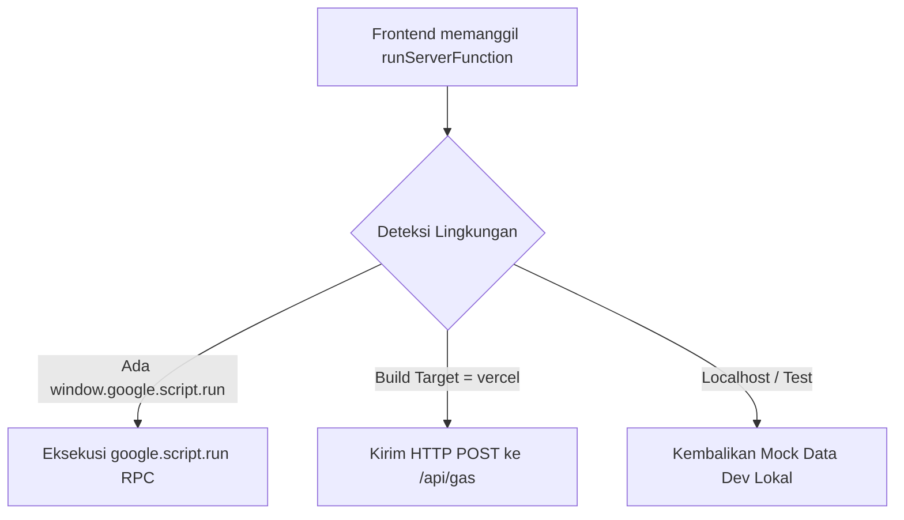

# 🏛️ Arsitektur Sistem Peminjaman Alat K3

Dokumen ini menjelaskan arsitektur teknis, pola komunikasi antarlayer, dan keputusan desain yang mendasari sistem **Manajemen Peminjaman Alat K3 Balai K3**.

---

## 1. Gambaran Umum Sistem (High-Level Architecture)

Aplikasi ini menggunakan model **Serverless / Low-Ops** yang memanfaatkan ekosistem Google Workspace (Google Sheets & Google Drive) sebagai backend dan penyimpanan data, dipadukan dengan frontend modern berbasis React & TypeScript.

```
┌─────────────────────────────────────────────────────────┐
│                    Aplikasi Frontend                    │
│           (React 18 + TypeScript + TailwindCSS)         │
└────────────────────────────┬────────────────────────────┘
                             │
              ┌──────────────┴──────────────┐
              ▼                             ▼
   Mode: Google Apps Script           Mode: Vercel Web
  (google.script.run native)       (fetch ke /api/gas proxy)
              │                             │
              └──────────────┬──────────────┘
                             │
                             ▼
              ┌─────────────────────────────┐
              │     Google Apps Script      │
              │         (Backend)           │
              │  - doGet() : Render HTML    │
              │  - doPost() : API Router    │
              │  - LockService (Anti-Race)  │
              └──────────────┬──────────────┘
                             │
              ┌──────────────┴──────────────┐
              ▼                             ▼
   ┌────────────────────┐        ┌────────────────────┐
   │   Google Sheets    │        │    Google Drive    │
   │  (Database Utama)  │        │   (File Storage)   │
   │ - KatalogAlat      │        │ - Berkas Surat     │
   │ - Transaksi        │        │   Tugas Sampling   │
   │ - DetailPinjam     │        │                    │
   │ - LogPerubahan     │        │                    │
   └────────────────────┘        └────────────────────┘
```

---

## 2. Strategi Dual Deployment

Aplikasi ini dirancang fleksibel untuk dapat berjalan dan dideploy ke **dua platform berbeda**:

| Fitur / Parameter | Google Apps Script (GAS) | Vercel (Edge / Serverless) |
|---|---|---|
| **Format Build** | Single-file HTML (`npm run build:gas` via `vite-plugin-singlefile`) | Multi-file SPA (`npm run build:vercel` dengan JS/CSS code splitting) |
| **Output File** | `backend/index.html` (HTML + CSS + JS inline) | `dist/` folder |
| **Koneksi Backend** | Langsung via `google.script.run` (RPC native) | HTTP `fetch` ke endpoint `/api/gas` (Reverse Proxy) |
| **Performa Kecepatan** | Terikat kecepatan runtime iframe GAS | Sangat cepat via Global CDN Edge Cache |
| **Kebutuhan Akun** | Cukup akun Google | Memerlukan setup akun Vercel |

---

## 3. Bridge Universal (`src/lib/gas.ts`)

Bagian paling penting yang menghubungkan Frontend dan Backend adalah fungsi `runServerFunction` di [`src/lib/gas.ts`](file:///d:/project/peminjaman%20alat/form-alat/src/lib/gas.ts).

Fungsi ini secara cerdas mendeteksi lingkungan saat aplikasi dibuka:



### Keuntungan Pola Ini:
1. **Developer Experience Luar Biasa**: Saat coding di localhost (`npm run dev`), developer tidak perlu setup Google Apps Script, tidak perlu login Google, dan tidak terkena delay network.
2. **Bebas Masalah CORS**: Di mode Vercel, request browser dikirim ke `/api/gas` (same domain), lalu serverless function Vercel yang meneruskannya ke script Google. Browser tidak pernah memanggil URL Google secara cross-origin.

---

## 4. Pemisahan Logika Murni (`backend/utils.js`)

Google Apps Script berjalan di lingkungan runtime V8 milik Google yang menyediakan objek global seperti `SpreadsheetApp`, `DriveApp`, `LockService`, dan `Utilities`.

Objek-objek ini **tidak tersedia di Node.js**. Agar logika bisnis (seperti validasi data dan parsing baris spreadsheet) dapat diuji secara otomatis dalam unit test, kami memisahkan fungsinya:

- [`backend/Code.js`](file:///d:/project/peminjaman%20alat/form-alat/backend/Code.js) — Berisi interaksi I/O dengan Sheets, Drive, dan API router.
- [`backend/utils.js`](file:///d:/project/peminjaman%20alat/form-alat/backend/utils.js) — Berisi logika murni (pure functions) yang tidak menyentuh SpreadsheetApp. File ini diekspor dengan `module.exports` sehingga dapat di-import langsung oleh Vitest di lingkungan Node.js.

---

## 5. Struktur Database (Google Sheets)

Database menggunakan satu Google Spreadsheet dengan beberapa Sheet yang saling berelasi:

### Sheet: `KatalogAlat`
Menyimpan master data inventaris peralatan sampling.
- `kode_alat` (String, PK) — Contoh: `HSM 01`, `SLM 05`
- `nama_alat` (String) — Contoh: `Heat Stress Monitor`
- `kondisi` (Enum: `Baik`, `Diperingatkan`, `Rusak`)
- `ketersediaan` (Enum: `Ready`, `Dipinjam`, `Kalibrasi`, `Maintenance`, `Pengusulan Lelang`, `Not Ready`, `Dimusnahkan`)

### Sheet: `TransaksiPeminjaman`
Menyimpan induk transaksi peminjaman.
- `id_transaksi` (String, PK) — Format `TRX-XXXXXXXX`
- `nama_peminjam` (String)
- `email` (String)
- `lokasi` (String)
- `tgl_pinjam` (Date / String YYYY-MM-DD)
- `tgl_kembali` (Date / String YYYY-MM-DD)
- `drive_file_id_surat` (String) — ID file Google Drive
- `jenis_pengujian` (Enum: `PNBP`, `DIPA`, `Praktik`)
- `nomor_surat` (String)

### Sheet: `DetailPinjam`
Menyimpan relasi many-to-many antara Transaksi dan Alat.
- `id_transaksi` (FK ke `TransaksiPeminjaman.id_transaksi`)
- `kode_alat` (FK ke `KatalogAlat.kode_alat`)
- `jumlah` (Number)

### Sheet: `Users`
Menyimpan data otentikasi login admin/petugas.
- `id` (String)
- `username` (String)
- `password_hash` (String, SHA-256 hash)
- `nama_petugas` (String)

### Sheet: `LogPerubahan` (Audit Trail)
Mencatat riwayat audit jika ada transaksi yang diedit atau dibatalkan.
- `waktu` (ISO Timestamp)
- `id_transaksi` (String)
- `tipe_aksi` (String, misal `EDIT_DETAIL`, `HAPUS_TRX`)
- `petugas` (String)
- `detail_sebelum` (JSON String)
- `detail_sesudah` (JSON String)

---

## 6. Panduan Menambah API Endpoint Baru

Jika Anda ingin menambahkan fitur/endpoint baru ke backend, ikuti 4 langkah terstruktur ini:

1. **Tulis Logika Backend di `backend/Code.js`**:
   ```javascript
   function getStatistikAlat() {
     try {
       // Logika baca sheets
       return { success: true, data: { ... } };
     } catch (err) {
       return { success: false, error: err.toString() };
     }
   }
   ```
2. **Daftarkan di Router `doPost` (`backend/Code.js`)**:
   Tambahkan nama fungsinya ke object `allowedFunctions`:
   ```javascript
   var allowedFunctions = {
     // ...
     'getStatistikAlat': getStatistikAlat,
   };
   ```
3. **Tambahkan Mock di `src/lib/gas.ts`**:
   Tambahkan blok `else if (functionName === 'getStatistikAlat')` pada penanganan dev mock agar dev server lokal tetap berfungsi.
4. **Tulis Unit Test**:
   Tambahkan pengujian di `src/lib/__tests__/gas.test.ts` untuk memastikan integrasi berjalan lancar.
